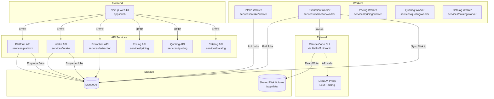
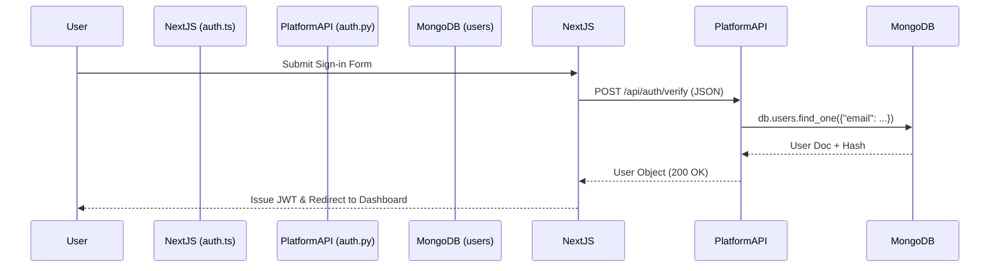
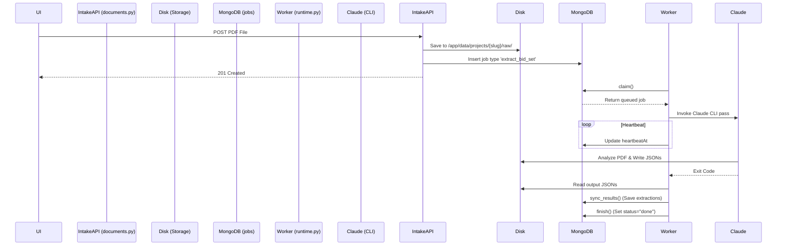

# CBC Estimating Copilot (Ops-Hub) Architecture & Lifecycle

## 1. Overview
The CBC Estimating Copilot (Ops-Hub) is a domain-bounded, microservices-style application built to assist in the bidding and quoting process. The backend is a set of Python FastAPI services and headless workers, communicating via a shared MongoDB instance and disk storage. The frontend is a Next.js web application. Machine learning/LLM features are powered by a worker tier that invokes the Claude Code CLI headlessly to perform extraction and pricing tasks on construction bid documents.

## 2. High-Level Architecture Diagram

## 3. Entry Points

| Component | Entry Point File Path | Purpose |
| --- | --- | --- |
| **Web Frontend** | `apps/web/package.json` (`next start`) | Next.js App Router providing the user interface. Proxies API requests. |
| **Platform API** | `services/platform/api/main.py` | FastAPI server handling auth, users, projects, and job queuing. |
| **Intake API** | `services/intake/api/main.py` | FastAPI server handling document uploads, rendering, and parsing. |
| **Domain APIs** | `services/{domain}/api/main.py` | FastAPIs for extraction, pricing, quoting, catalog. |
| **Domain Workers** | `services/{domain}/worker/main.py` | Executes background jobs by importing `cbc.worker_kit.runtime`. |
| **LiteLLM** | `ghcr.io/berriai/litellm` (via `infra/docker-compose.yml`) | Proxies LLM API calls, configured via `infra/docker/litellm.config.yaml`. |

## 4. Startup Sequence

1. **Infrastructure (Docker Compose)**: `infra/docker-compose.yml` boots `mongo` and `litellm`.
2. **Backend APIs (e.g. Platform)**:
   - `uvicorn api.main:app` runs `services/platform/api/main.py`.
   - `envfile.apply_to_environ()` applies env vars.
   - `lifespan` context manager starts:
     - `ensure_indexes()` (`packages/cbc/db.py`) connects to MongoDB and idempotently applies indexes.
     - `ensure_readonly_user()` (`packages/cbc/db.py`) creates a read-only MongoDB user for the catalog MCP server.
     - Spawns background tasks like `_oauth_sweep_loop`.
   - `FastAPI` instance is created, adding `CORSMiddleware` and `InternalAuthMiddleware` (`packages/cbc/http/deps.py`).
   - Routers are included (e.g. `auth`, `users`, `projects`, `jobs`).
3. **Backend Workers**:
   - `python service/worker/main.py` runs `packages/cbc/worker_kit/runtime.py`.
   - `db_module.ensure_indexes()` ensures the database is ready.
   - Polling loop starts: calls `claim()` (`worker_kit/runtime.py`) to atomically lock jobs from the `jobs` collection.
4. **Web Frontend**:
   - `next start` (Next.js server).
   - Middleware `apps/web/proxy.ts` applies route protection to unauthenticated paths via NextAuth.

## 5. Core Lifecycle Flows

### Flow 1: HTTP API Request (Sign-in)
1. **Trigger**: User posts credentials via the Next.js UI (`apps/web/app/signin`).
2. **NextAuth**: `apps/web/auth.ts` intercepts via the `Credentials` provider.
3. **Internal Call**: NextAuth calls `${API_BASE}/api/auth/verify` via HTTP.
4. **Platform API**: `services/platform/api/routers/auth.py` (assumed based on `main.py`) receives the request.
5. **Database**: The router queries `db.users` (`packages/cbc/db.py`) and compares password hashes. Records attempt in `db.auth_attempts`.
6. **Response**: User object is returned to NextAuth, which issues a JWT session token. Next.js `proxy.ts` redirects the user to `/dashboard`.

### Flow 2: Queued Job (Document Upload & Extraction)
1. **Trigger**: User uploads a PDF to Intake API.
2. **Intake Route**: `services/intake/api/routers/documents.py: upload_document()` receives the file.
3. **Storage**: PDF is saved to disk via `storage.receive_upload()` (`projects/{slug}/uploads/raw/`).
4. **Enqueue**: `enqueue_pipeline()` inserts an `extract_bid_set` job into `db.jobs` with `status="queued"`.
5. **Worker Poll**: `services/extraction/worker/main.py` (via `packages/cbc/worker_kit/runtime.py`) loops and calls `claim()`, finding and claiming the job (`status="running"`, sets `workerId`).
6. **Execution**: `process()` (`runtime.py`) executes. Since it's not a local handler, it triggers a headless Claude Code CLI pass over the bid set to extract data into JSON files on the shared disk.
7. **Heartbeat**: During extraction, `_beat()` continually updates `heartbeatAt` in Mongo to prevent the job from being reaped.
8. **Sync**: `sync_results()` (`runtime.py`) is called to move Claude's JSON outputs on disk into Mongo (e.g. `sync.import_extraction()`).
9. **Orchestration**: If autopilot is on, `orchestrator.maybe_continue_chain()` automatically queues the next phase (e.g. `match_and_price`).
10. **Cleanup**: `finish()` (`runtime.py`) updates job `status="done"` and clears `workerId`.

## 6. Module Map

| Module / Package | Responsibility | Key Files | Dependencies | Dependents |
| --- | --- | --- | --- | --- |
| `apps/web` | Next.js Frontend | `auth.ts`, `proxy.ts`, `package.json` | Platform API, Intake API | (None) |
| `services/platform` | Auth, users, projects, global settings, job queuing | `api/main.py`, `api/routers/jobs.py` | `packages/cbc` | `apps/web` |
| `services/intake` | Document upload, rendering | `api/main.py`, `api/routers/documents.py`, `worker/main.py` | `packages/cbc` | `apps/web` |
| `services/extraction` | Take-off & scope generation | `api/main.py`, `worker/main.py` | `packages/cbc` | `apps/web`, Orchestrator |
| `services/pricing` | Applying price books | `api/main.py`, `worker/main.py` | `packages/cbc` | `apps/web`, Orchestrator |
| `services/quoting` | Quote generation and proposal artifact rendering | `api/main.py`, `worker/main.py` | `packages/cbc` | `apps/web`, Orchestrator |
| `services/catalog` | Product/price book indexing | `api/main.py`, `worker/main.py` | `packages/cbc` | `apps/web` |
| `packages/cbc` | Shared business logic, database wrappers, schemas, worker runtime | `db.py`, `worker_kit/runtime.py` | PyMongo, FastAPI, Pydantic | All `services/*` |

## 7. Data Layer
* **Storage Engines**: 
  - MongoDB (Primary state, JSON objects).
  - Shared Disk Volume (`/app/data/projects`, `/app/data/pricebooks`) used for holding raw PDFs and Claude output JSON artifacts.
* **MongoDB Collections** (`packages/cbc/db.py`):
  - `users`, `projects`, `documents`, `line_items`, `quote_lines`, `quotes`, `proposals`, `products`, `price_books`, `jobs`, `audit_log`, `calls`, `estimate_versions`, `counters`, `settings`, `auth_attempts`, `oauth_sessions`, `run_metrics`.
* **Database Indexes**: Configured idempotently on boot via `ensure_indexes()` in `packages/cbc/db.py`. Heavy use of compound and unique indexes (e.g. `{"projectId": 1, "division": 1}`). Includes `partialFilterExpression` on `jobs` to enforce that only one exclusive job runs per project.
* **Schema Mapping**: Driven heavily by the disk artifacts created by Claude, mapped via Python services (`sync.py` / `schemas/`).
* **Migrations**: Seemingly implicitly managed. `ensure_indexes()` handles adding/upgrading index structures transparently on startup (`_replace_index`).

## 8. Auth & Security Flow
1. **Frontend**: NextAuth handles user session state (`apps/web/auth.ts`). Unauthenticated users hitting anything outside `/api/auth` are redirected to `/signin` via `proxy.ts`.
2. **Backend**: APIs use `InternalAuthMiddleware` (`packages/cbc/http/deps.py`) to validate `INTERNAL_API_TOKEN` which prevents outside tampering.
3. **Database Security**: `ensure_readonly_user()` (`cbc/db.py`) creates a specific `cbc_catalog_ro` user scoped to read-only for Claude's MCP catalog servers to prevent destructive queries by the LLM.

## 9. Error Handling & Observability
* **Global Error Handlers**: FastAPIs map `ValueError` directly to 400 Bad Request JSON (`services/platform/api/main.py`).
* **Worker Resilience**: Jobs are given an attempt budget (`MAX_ATTEMPTS = 3`). Failures are retried using exponential backoff: `RETRY_BASE_SECONDS * 2 ** (attempts - 1)` (`packages/cbc/worker_kit/runtime.py`).
* **Zombie Job Reaper**: `reap_abandoned()` runs periodically. If a worker dies and its heartbeat (`heartbeatAt`) is older than `STALE_AFTER` (90s), the job is reset to "queued" or failed.
* **Observability**: Uses structured logging (`cbc.core.logs`). Every major step is saved to `db.audit_log` (`cbc.services.audit.record`). Token costs and run metrics for Claude are parsed post-run and inserted into `db.run_metrics`.

## 10. Configuration & Environments
* **Environment Variables**: Primary configuration method, specified via `.env` and injected heavily in `infra/docker-compose.yml`.
* **Important Variables**: 
  - `MONGODB_URI`
  - `STORAGE_ROOT` (`/app/data/projects`)
  - `INTERNAL_API_TOKEN`
  - `APP_ENV` (development/production)
  - `WORKER_DOMAIN` (Restricts which jobs a worker pulls).
* Python modules load config dynamically via `cbc.core.envfile` and `cbc.config.settings`.

## 11. External Integrations
* **LiteLLM**: Proxy layer configured on port 4000 to unify LLM requests.
* **Claude Code CLI (`@anthropic-ai/claude-code`)**: Installed globally in the base Docker image (`Dockerfile`). Orchestrated headlessly by the workers to manipulate data.
* **Ollama/Local LLMs**: Referenced in `OLLAMA_BASE_URL` inside `infra/docker-compose.yml`.
* **MCP Servers**: Custom Model Context Protocol servers are configured inside the `mcp-servers` directory and connected to Claude to grant the LLM read-only access to MongoDB data.

## 12. Shutdown & Cleanup
* **API**: Handled by FastAPI `@asynccontextmanager def lifespan(app)` hooks. They cancel background tasks, such as `sweep_task.cancel()` for wiping old OAuth sessions (`services/platform/api/main.py`).
* **Workers**: `asyncio.Event()` bounds the main worker execution. The OS signals (SIGTERM/SIGINT) trigger graceful job termination. Active jobs missing heartbeats are safely reaped on the next startup.

## 13. Build & Deployment Notes
* **Dockerfile**: A single multi-stage build (`Dockerfile`) at the repo root handles all backend APIs and workers. It uses `ARG SERVICE` to conditionally build the image for the specified domain (e.g. `docker build --build-arg SERVICE=extraction -t cbc-extraction .`).
* **System Dependencies**: The container installs global npm modules (Claude Code) and OS dependencies for PDF rendering (`poppler-utils`, `libcairo2`, `libpango`).
* **docker-compose.yml**: Explicitly splits services out (`platform`, `intake-api`, `intake-worker`, etc.), ensuring the API scaling is detached from worker scaling.

## 14. Open Questions / Ambiguities
* **Claude Run Mechanism**: I was unable to view the exact code inside `packages/cbc/core/claude_cli.py` or the `process()` function details inside `worker_kit/runtime.py` to see exactly how Claude Code is spawned and how prompts are structured.
* **Orchestrator Chain Logic**: `packages/cbc/services/orchestrator.py` manages the "autopilot" feature, automatically bridging extraction -> pricing -> quoting, but I did not trace exactly how failures in autopilot are handled for mid-chain tasks.
* **UI Structure**: I did not explore Next.js components to map out the exact view hierarchy or SWR data fetching patterns.

## 15. Glossary
* **Autopilot**: A mode where extraction, matching, and pricing are chained automatically without user intervention between steps.
* **Domain Service**: A vertical slice of the application (e.g., Intake, Pricing) that contains both a REST API and a headless Worker.
* **MCP Server**: Model Context Protocol servers used to give Claude Code structured, read-only tools to view MongoDB data (like price books).
* **Price Book**: A structured catalog of construction materials and their costs.
* **Bid Set**: The PDF architectural drawings uploaded by the user to be quoted.
