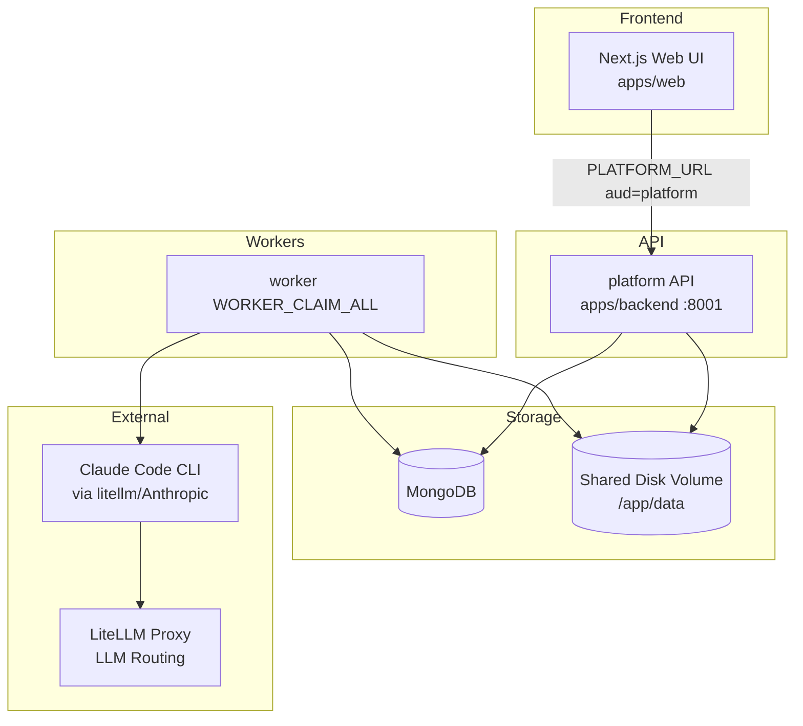
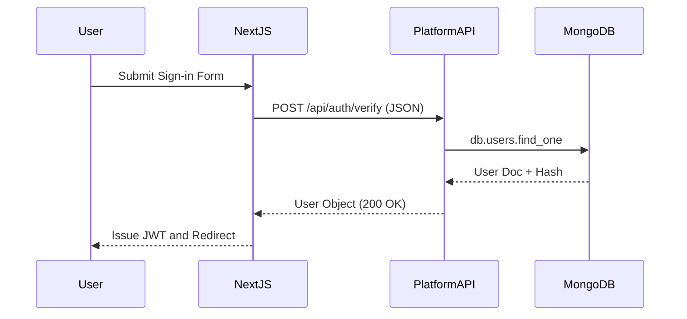
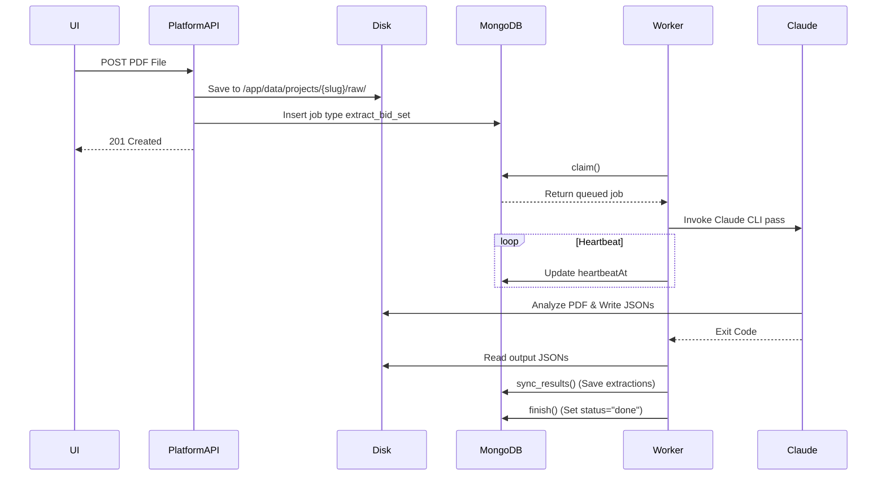

# CBC Estimating Copilot (Ops-Hub) Architecture & Lifecycle

> **Live runtime (Phase 5+):** one FastAPI process under `apps/backend`
> (compose service `platform` on port 8001). Web proxies all `/api` traffic to
> `PLATFORM_URL` with JWT audience `platform`. One compose `worker` claims all
> Mongo jobs via `WORKER_CLAIM_ALL=1` using `python -m cbc.worker`. Pre-monolith
> trees are under `archive/pre-monolith/` (rollback only).

## 1. Overview
The CBC Estimating Copilot (Ops-Hub) assists bidding and quoting. The live
backend is a modular monolith (`apps/backend`) plus one headless worker that
invokes the Claude Code CLI. The frontend is Next.js (`apps/web`). API and worker
share MongoDB, disk/S3, and a Mongo job queue — there is no inter-domain HTTP.

## 2. High-Level Architecture Diagram



## 3. Entry Points

| Component | Entry Point File Path | Purpose |
| --- | --- | --- |
| **platform API** | `apps/backend` → `cbc.api.main:app` | FastAPI monolith: auth, projects, documents, line-items, quote, catalog, … |
| **Worker** | `python -m cbc.worker` (`WORKER_CLAIM_ALL=1` in compose) | Claim and run Claude / local catalog jobs |
| **Web** | `apps/web` | Next.js Ops-Hub; proxies to `PLATFORM_URL` |
| **Compose** | `infra/docker-compose.yml` | mongo, clamav, platform, worker, web |

Start (Docker):

```bash
docker compose -f infra/docker-compose.yml up -d --build
```

Start (native API):

```bash
cd apps/backend && pip install -e ".[dev]" && uvicorn cbc.api.main:app --port 8001
```

## 4. Startup Sequence

1. **Infrastructure**: `infra/docker-compose.yml` boots `mongo` (and optional `litellm` / `clamav`).
2. **platform API**: `uvicorn cbc.api.main:app` from `apps/backend`.
   - Lifespan runs `ensure_indexes()`, `ensure_readonly_user()`, OAuth sweep.
   - All domain routers mount on one FastAPI app (`SERVICE_AUDIENCE=platform`).
3. **Worker**: compose `worker` with `WORKER_CLAIM_ALL=1`; claim loop in `cbc.worker_kit.runtime` (local runs may set `WORKER_DOMAIN`).
4. **Web**: `next start`; `/api/proxy/*` forwards to `PLATFORM_URL` with audience `platform`.

## 5. Core Lifecycle Flows

### Flow 1: HTTP API Request (Sign-in)
1. **Trigger**: User posts credentials via the Next.js UI (`apps/web/app/signin`).
2. **NextAuth**: `apps/web/auth.ts` intercepts via the `Credentials` provider.
3. **Internal Call**: NextAuth calls `${API_BASE}/api/auth/verify` via HTTP.
4. **platform API**: auth router under `apps/backend` (`cbc.modules.platform`) receives the request.
5. **Database**: Queries `db.users`, compares password hashes, records `db.auth_attempts`.
6. **Response**: User object returned to NextAuth; session JWT issued; redirect to `/dashboard`.



### Flow 2: Queued Job (Document Upload & Extraction)
1. **Trigger**: User uploads a PDF via the web proxy to platform documents API.
2. **Route**: Intake documents router in `apps/backend` receives the file.
3. **Storage**: PDF saved under `projects/{slug}/uploads/raw/`.
4. **Enqueue**: Pipeline job (e.g. `extract_bid_set`) inserted into `db.jobs`.
5. **Worker Poll**: compose `worker` (`WORKER_CLAIM_ALL=1`) claims the job.
6. **Execution**: `cbc.worker_kit.runtime` runs a headless Claude Code pass (or local handler).
7. **Heartbeat**: Updates `heartbeatAt` so the job is not reaped.
8. **Sync**: Disk JSON artifacts synced into Mongo.
9. **Orchestration**: Autopilot may enqueue the next phase (e.g. `match_and_price`).
10. **Cleanup**: Job `status="done"`.



## 6. Module Map

| Module / Package | Responsibility | Key Files |
| --- | --- | --- |
| `apps/web` | Next.js Ops-Hub | proxy, auth, pages |
| `apps/backend` | Live modular monolith API + worker runtime | `cbc.api.main`, `cbc.modules.*`, `cbc.worker_kit` |
| `mcp-servers` | Claude MCP tools | per-server `server.py` |
| `archive/pre-monolith/` | Pre-cutover services/packages/Dockerfile/tests | rollback only |

## 7. Data Layer
* **Storage Engines**: MongoDB + shared disk (`/app/data/projects`, `/app/data/pricebooks`).
* **Collections / indexes**: `cbc.db` in `apps/backend` (`ensure_indexes` on boot).
* **Migrations**: Startup helpers on the monolith lifespan.

## 8. Auth & Security Flow
1. NextAuth on `apps/web`.
2. Backend internal JWT (`aud=platform`) or `INTERNAL_API_TOKEN`.
3. Read-only Mongo user for catalog MCP (`ensure_readonly_user`).

## 9. Error Handling & Observability
Worker retry/backoff and `reap_abandoned` in `cbc.worker_kit.runtime`; audit + run_metrics via shared services.

## 10. Configuration & Environments
Compose injects `MONGODB_URI`, `STORAGE_ROOT`, `PLATFORM_URL` / `API_BASE_URL`, `INTERNAL_*`, `APP_ENV`, `WORKER_CLAIM_ALL`. Settings via `cbc.config`.

## 11. External Integrations
Optional LiteLLM; Claude Code in worker image; MCP under `mcp-servers/`.

## 12. Shutdown & Cleanup
API lifespan cancels background tasks; workers handle SIGTERM/SIGINT; stale jobs reaped.

## 13. Build & Deployment Notes
* Live image: `apps/backend/Dockerfile` (`api` + `worker` targets).
* Root `Dockerfile`: legacy rollback only.
* Compose: `platform` + `worker` + `web` (no live domain `*-api` / `*-worker`).

## 14. Open Questions / Ambiguities
* Prefer `apps/backend/tests` for the live path; archived suites live under
  `archive/pre-monolith/tests/`.
* Agent prompts and sandbox details live under `.claude/` and `cbc.worker_kit`.

## 15. Glossary
* **Autopilot**: A mode where extraction, matching, and pricing are chained automatically without user intervention between steps.
* **Domain module**: A vertical slice under `apps/backend/src/cbc/modules/` (HTTP); jobs are claimed by the compose claim-all worker (or a filtered `WORKER_DOMAIN` process locally).
* **MCP Server**: Model Context Protocol servers used to give Claude Code structured, read-only tools to view MongoDB data (like price books).
* **Price Book**: A structured catalog of construction materials and their costs.
* **Bid Set**: The PDF architectural drawings uploaded by the user to be quoted.
