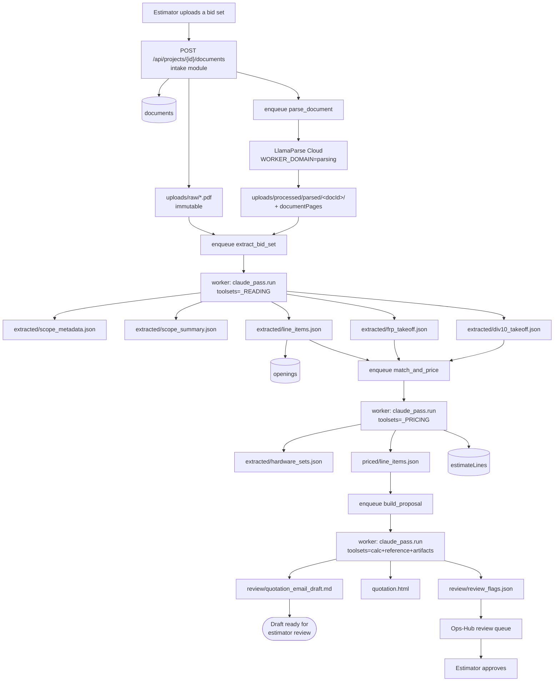
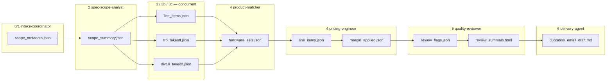
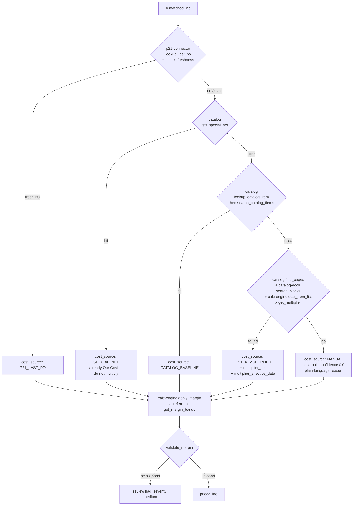
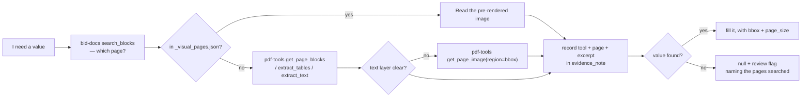
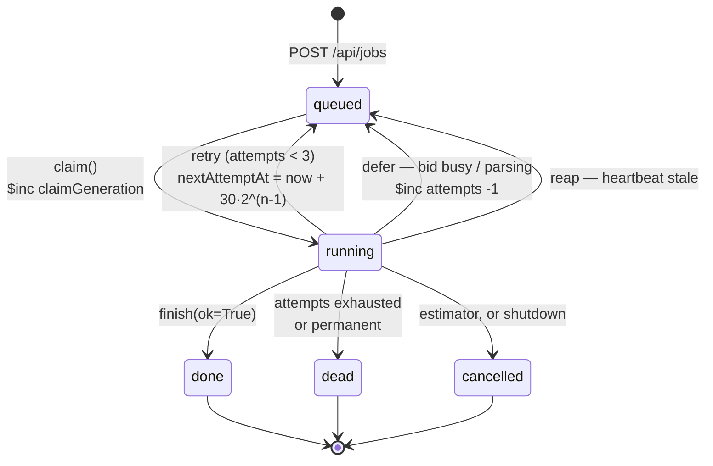
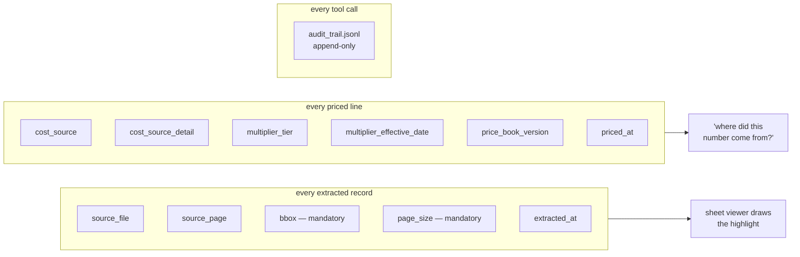

# Data flow

How a bid moves through the system, and where each piece of data comes to rest.
Every box names something you can open.

## End to end



The three `enqueue` steps are the autopilot chain in
`projects/api/autopilot.py`; each is enqueued when the previous job succeeds.

## Artifact handoffs

Which phase reads what. This is the contract that lets a phase be rerun on its
own.



## Where a cost comes from

The decision tree in [Phase 4](pipeline/phase-4-pricing.md), as data flow. Each
path is tried in order; the first that answers wins, and the line records which
one it was.



A miss from the catalog **is an answer** — it means CBC has no row for that
vendor, which is true for Allegion and Zero. The correct next step is manual,
not a PDF hunt for a substitute.

## Reading a PDF

Every phase that touches a drawing follows the same two-step, because the cheap
tool and the accurate tool are different tools.



`bid-docs` finds; `pdf-tools` reads. Searching with `pdf-tools` across a whole
set is what the block index exists to avoid.

## Request paths

Two routes into the API, and they are not interchangeable.

```mermaid
flowchart LR
  SC["Server component"] -->|"lib/api.ts — GET only"| NX
  BR["Browser"] -->|fetch| PX["app/api/proxy/[...path]"]
  PX -->|auth() or 401| PX2["strip actor param<br/>allow-list headers<br/>reject .. and %2f<br/>mint X-Trace-Id"]
  PX2 --> NX["internal-api.ts<br/>X-Internal-Token or 60s JWT"]
  NX --> API["platform:8001"]
  API --> MW["TraceMiddleware<br/>→ InternalAuthMiddleware<br/>→ CORS"]
  MW --> RT["module router"]
```

`lib/api.ts` is `server-only` and exports `get` alone — **every write goes
through the proxy**, so there is exactly one place that authenticates a
browser-originated mutation. Note that `proxy.ts`'s matcher deliberately
excludes `api/proxy`, so a client fetch gets a real 401 rather than a 200
carrying sign-in HTML.

## A job's life



Every transition out of `running` is guarded on workerId **and**
`claimGeneration`, so a worker that was declared dead and then wakes up cannot
write over its replacement. A defer costs no attempt.

## Provenance

What makes a number auditable months later.



`bbox` and `page_size` together are what make a page number useful: a page
reference alone names a sheet the estimator still has to search by eye, and
`page_size` is what the viewer scales the box against. A transposed width and
height is every number being real and the highlight landing nowhere near its
row — which is why
`extraction/api/validation/artifacts.check_extraction` verifies the box sits on
real text and that `page_size` matches the frame it was measured in.

## See also

- [`system-design.md`](system-design.md) — the structure these flows run on
- [`pipeline/README.md`](pipeline/README.md) — what each phase does
- [`collections.mongodb.md`](collections.mongodb.md) — where the data lands
