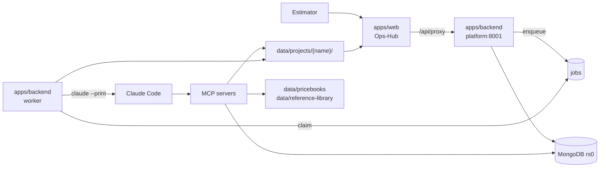

# System design

CBC Estimating Copilot turns a bid set of PDFs into a draft quotation for an
estimator to review. It is a modular monolith: one FastAPI process, one worker
process, one Next.js app, one MongoDB, and eight local MCP servers that give a
Claude pass its hands.

The design has four commitments, and most of the structure falls out of them:

- **Preserve the input.** Raw uploads are immutable; nothing writes back over
  them.
- **Checkpoint every phase.** Each stage writes a named artifact the next stage
  reads, so any one phase can be rerun without recomputing the rest.
- **Keep every number traceable.** A priced line names its source page and its
  price sheet, or it is flagged.
- **Stop before sending.** Delivery ends at a draft. A person sends.

## The shape



Both processes run the same code. `cbc.app.main` serves HTTP; `cbc.app.worker`
claims jobs. They share every module, so an estimator editing a margin band in
the UI and a pricing pass reading one go through the same
`cbc.modules.pricing.api`.

## Backend

Seven modules under `apps/backend/src/cbc/modules/`, each owning its own
collections and reaching the others only through their published `api/`:

| | |
|---|---|
| **ops** | auth, users, audit, spend, the job queue, the worker loop, Claude provider config |
| **projects** | the bid record and the autopilot state machine |
| **pricing** | margin bands, tax, adders, tiers, nets, finishes, frame depths |
| **catalog** | parts, vendor price books, page index, match learning |
| **extraction** | openings, take-offs, estimator corrections |
| **quoting** | priced lines, totals, proposal, RFQs and RFIs |
| **intake** | document upload, page render, parse, addendum versions |

`ops` depends on nothing; everything else builds on it. The graph is acyclic and
checked on every run. Downward dependencies are inverted through explicit
`bind(...)` ports rather than a DI container, so the wiring is greppable.

The boundaries are not conventions — seven rules in
`apps/backend/tests/architecture/test_layering.py` execute them, so a module
that reaches past another's `api/` fails the build.

**Details:** [`backend/modules.md`](backend/modules.md) ·
[`backend/api.md`](backend/api.md) · [`backend/worker.md`](backend/worker.md)

## Frontend

`apps/web` is a Next.js 16 App Router application and a **consumer of pipeline
state** — every number it shows was computed by the backend. Server components
read through `lib/api.ts`, which is deliberately read-only; every write goes
through `app/api/proxy/[...path]`, which authenticates, blocks path traversal,
strips the `actor` parameter so a client cannot spoof identity, and streams the
response back.

**Details:** [`frontend/routes.md`](frontend/routes.md) ·
[`frontend/design-system.md`](frontend/design-system.md)

## How work gets done

Nothing is scheduled by a broker. A job is a document in `jobs`; claiming it is
one atomic `find_one_and_update` that stamps a `claimGeneration` fencing token.
Every later write is guarded on that token, so a worker declared dead cannot
overwrite its replacement.

Three job types chain to cover a bid:

```
extract_bid_set → match_and_price → build_proposal
```

Reasoning jobs run Claude Code headlessly with a scoped MCP config
(`--strict-mcp-config`), a per-job sandbox clone of the bid directory, and a
prompt assembled from one source that both the worker and the shell scripts
read.

**Details:** [`backend/worker.md`](backend/worker.md)

## The pipeline

Eight phases, each owned by a subagent, each writing a named artifact:

| Phase | Agent | Artifact |
|---|---|---|
| 0/1 intake | `intake-coordinator` | `extracted/scope_metadata.json` |
| 2 spec scope | `spec-scope-analyst` | `extracted/scope_summary.json` |
| 3 take-off | `takeoff-engineer` | `extracted/door_schedule.json` |
| 3b FRP | `frp-specialist` | `extracted/frp_takeoff.json` |
| 3c Div 10 | `div10-specialist` | `extracted/div10_takeoff.json` |
| 4 match | `product-matcher` | `extracted/hardware_sets.json` |
| 4 price | `pricing-engineer` | `priced/line_items.json` |
| 5 review | `quality-reviewer` | `review/review_flags.json` |
| 6 delivery | `delivery-agent` | `review/quotation_email_draft.md` |

The three take-offs run concurrently. Three agents run on Sonnet —
`takeoff-engineer`, `product-matcher`, `pricing-engineer` — because their work
is judgment that cannot be checked mechanically. The rest run on Haiku.

The pattern worth understanding: **a subagent verifies a seeded artifact, it
does not author one.** A deterministic parser writes the door schedule in code
first; the agent checks it against the sheets and corrects it field by field
with page-cited patches. Whole-file rewrites of a seeded checkpoint are blocked.

**Details:** [`pipeline/README.md`](pipeline/README.md) ·
[`agents/pipeline-agents.md`](agents/pipeline-agents.md)

## Data ownership

**MongoDB** holds the structured record — 32 collections across customers,
vendors, price books, margin rules, bid requests, documents, openings,
estimates, versions, line items, review history and the audit trail. Every one
is specified field by field in
[`collections.mongodb.md`](collections.mongodb.md).

**The project directory** is the working surface for a bid. Each phase writes a
small named artifact there rather than mutating one large document:

```
uploads/raw/     immutable input
extracted/       scope, schedule, take-offs, matches
priced/          line items, margins
review/          flags, summary, email draft
quotation.html   the rendered draft
audit_trail.jsonl  one record per tool call, append-only
.versions/       SHA-256 content blobs + an append-only index
```

`data/pricebooks/` and `data/reference-library/` are **read-only during a run**.
Updating them is a separate, deliberate, human act — which is what the Ops-Hub
price-book upload is.

**Details:** [`operations/running.md`](operations/running.md#the-project-directory)

## Guardrails

Safety does not come from permission prompts — the pipeline runs unattended and
cannot answer one. It comes from hooks that fire regardless of permission mode:

- **`pre_send_quote.py`** blocks every mail path and any tool whose name
  contains send, email or mail. Exit 2.
- **`pre_delete_guard.py`** confines writes, protects reference data, forces
  checkpoints through `save_artifact`, and blocks recursive deletes outside the
  project directory and `git push`.
- **`post_extraction_validate.py`** blocks a malformed checkpoint from
  propagating.
- **`log_audit_trail.py`** records every tool call.

Both guard scripts are pinned by shell tests that CI runs **before** the test
suite, including the three bypasses an audit once found.

**Details:** [`agents/guardrails.md`](agents/guardrails.md)

## Read-only by construction

Seven of the eight MCP servers cannot write. They assert it at import: a tool
name containing a write verb fails the module load. `p21-connector` builds only
HTTP GETs and, with no endpoint configured, returns a structured "manual entry
required" contract rather than a guessed price. `artifact-storage` is the sole
writer and is confined by a path allowlist, a `projects/` escape check, a schema
gate and SHA-256 versioning.

**Details:** [`mcp/servers.md`](mcp/servers.md)

## What this optimises for

Repeatable estimates from one-off and templated bids. Clear handoffs, so a
phase can be rerun in isolation. Provenance dense enough to audit months later.
And one implementation of each business rule, shared by the UI, the API, the
worker and the headless scripts — which is why `calc-engine` is an adapter over
`cbc.modules.pricing.api.calc` rather than a second implementation of the same
arithmetic.

## What it does not do

It does not send. It does not decide. It does not route a below-band margin for
approval — it flags it and leaves it to the estimator. Approval routing,
data-stewardship ownership and the P21 integration are open items, tracked in
[`data_stewardship.md`](data_stewardship.md).
